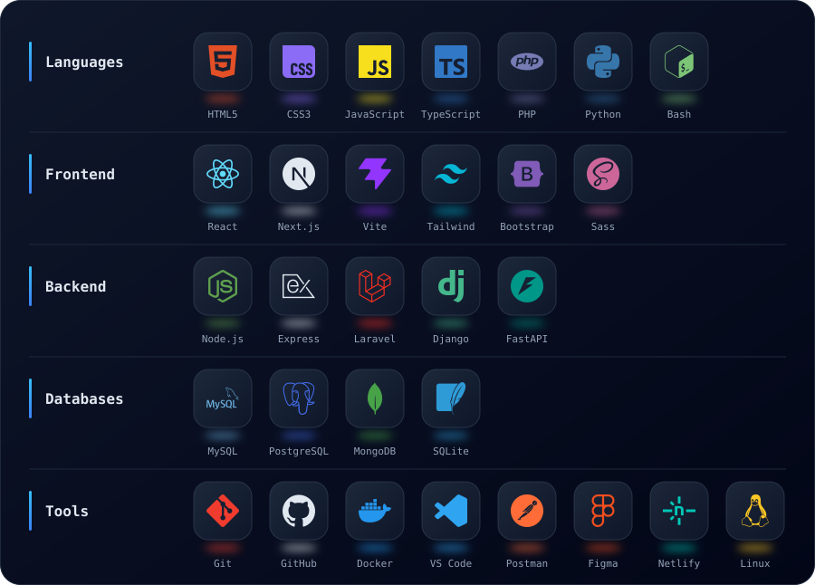

<div align="center">


<br/><br/>

<a href="https://aminedahou.runs-on.dev"></a>
<a href="https://linkedin.com/in/mohamed-amine-dahou-033a7a372"></a>
<a href="mailto:mohamedaminedahou.dev@gmail.com"></a>


<br/><br/>


</div>


<div align="center">
  
</div>

```js
const amine = {
  name: "Mohamed Amine Dahou",
  role: "Full-Stack Web Developer",
  location: "Morocco",
  stack: ["React", "Tailwind CSS", "Laravel", "Node.js", "Python"],
  currentlyLearning: ["Modern frameworks", "Clean architecture", "Web performance"],
  openToWork: true,
  lookingFor: "Pre-hire internship (stage pré-embauche)",
  motto: "Clean code, fast apps, great UX",
};
```


<div align="center">
  
</div>

<div align="center">
  
</div>


<div align="center">
  
</div>

<div align="center">
  
</div>


<div align="center">
  
</div>

<div align="center">








</div>


<div align="center">
  
</div>

<div align="center">
  
</div>


<div align="center">
  
</div>

<!-- START_SECTION:projects -->
<table align="center">
  <tr>
    <td width="50%" valign="top">
      <h3><a href="https://github.com/amineedahou/contact-manager-react">contact-manager-react</a></h3>
      <p>A modern, full-stack contact management application built with React and Tailwind CSS — designed to make organizing, searching, and…</p>
      
      <br/><br/>
      <a href="https://contact-manager-react-eight.vercel.app"></a>
      <a href="https://github.com/amineedahou/contact-manager-react"></a>
      <br/><sub>Updated Sep 6, 2026</sub>
    </td>
    <td width="50%" valign="top">
      <h3><a href="https://github.com/amineedahou/portfolio">portfolio</a></h3>
      <p>Welcome to my professional portfolio! This is a clean, performance-optimized personal website designed to showcase my skills and projects…</p>
      
      <br/><br/>
      <a href="https://github.com/amineedahou/portfolio"></a>
      <br/><sub>Updated May 7, 2026</sub>
    </td>
  </tr>
</table>
<!-- END_SECTION:projects -->


<div align="center">


<br/>

<a href="https://aminedahou.runs-on.dev"></a>
<a href="https://linkedin.com/in/mohamed-amine-dahou-033a7a372"></a>
<a href="mailto:mohamedaminedahou.dev@gmail.com"></a>


</div>
